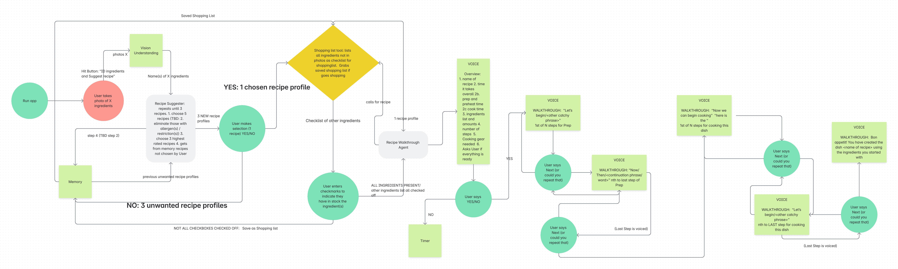

# Architecture Overview

## Architecture

* **Backend:** FastAPI + Google ADK (Agent Development Kit)
* **Vision Agent:** Multimodal Google Gemini Pro Vision model for image-to-ingredient detection
* **Frontend:** Next.js / React
* **AI Models:** Google Gemini 2.5 Flash
* **Search:** DuckDuckGo for web recipe search

Below, sketch (ASCII, hand-drawn JPEG/PNG pasted in, or ASCII art) the high-level components of your agent.

## Components

1. **User Interface**  
   - App GUI
   - Camera Upload
   - Manual Ingredients Input
   - Recipe List
   - Recipe Details

2. **Agent Core**  
 - **Planner**:
 - Breaks tasks into steps: detect → search → guide.
 - Routes user input to the correct agent: Suggester (manual input), Sous Chef (cooking steps), or Vision (image).
 - **Executor**:
 - Runs agents via Google ADK using Gemini (Flash/Vision).
 - Calls tools like image detection, web search, and timers based on task needs.
 - **Memory**:
 - Tracks session data: ingredients, recipe, step progress, timers.

4. **Tools / APIs**  
   - AI Models: Google Gemini 2.5 Flash
   - Search: DuckDuckGo for web recipe search

5. **Observability**  
   - Logging of each reasoning step  
   Loguru library used in sous-chef-agent.py and timer-tool.py
   - Error handling / retries

